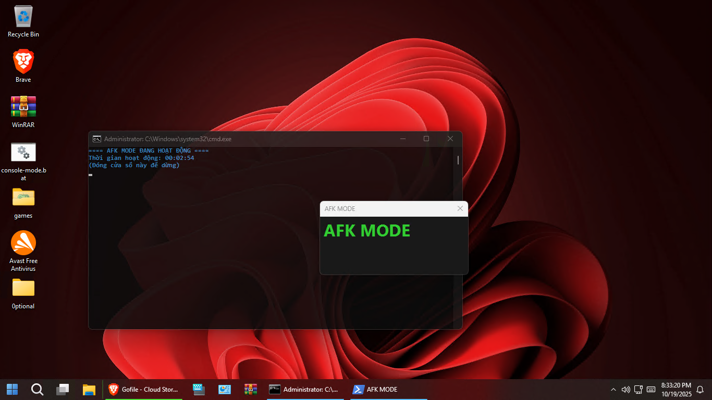

# 🖥️ FIX-SHUTDOWN-RDP (AFK MODE)

Giữ cho phiên Remote Desktop (RDP) luôn **hoạt động** ngay cả khi bạn thoát hoặc không thao tác — ngăn Windows tự shutdown hoặc sleep ngoài ý muốn.

---

## 📸 ẢNH DEMO



---

## ⚙️ TÍNH NĂNG

✅ Ngăn Windows tự động **shutdown / sleep / idle**  
✅ Tự động tải và chạy **sleep.py** mới nhất từ GitHub  
✅ Giao diện hiển thị **thời gian hoạt động AFK MODE**  
✅ Tự yêu cầu quyền **Administrator** nếu chưa có  
✅ Có thể mở rộng thêm tính năng (đổi wallpaper, auto-run...)

---

## 🚀 CÀI ĐẶT VÀ SỬ DỤNG

### **Cách 1: Dễ nhất (Auto Mode)**

1. Tải file `.bat` tại đây:  
   👉 [auto.bat (RAW)](https://raw.githubusercontent.com/zenixbot0101/FIX-SHUTDOWN-RDP/refs/heads/main/auto.bat)
2. Nhấn chuột phải → **Run as Administrator**
3. Script sẽ:
   - Tự động tải `sleep.py` mới nhất về `C:\sleep.py`
   - Chạy chế độ **AFK MODE**

> 💡 Nếu chưa cài Python: [Tải Python tại đây](https://www.python.org/downloads/)

---

### **Cách 2: Chạy thủ công**

```bash
git clone https://github.com/zenixbot0101/FIX-SHUTDOWN-RDP
cd FIX-SHUTDOWN-RDP
python sleep.py
```

---

## 🔧 CÁCH HOẠT ĐỘNG

- Script sẽ gửi tín hiệu **keep-alive** định kỳ  
- Sử dụng API `SetThreadExecutionState` để ngăn Windows sleep  
- Có thể tùy chỉnh thêm:  
  - Wallpaper AFK MODE  
  - Âm báo khi ngắt kết nối  
  - Tự động khởi động cùng hệ thống  

---

## ⚠️ LƯU Ý

- Cần chạy với **quyền Administrator** để hoạt động ổn định  
- Không sử dụng trên máy chủ không thuộc quyền sở hữu  
- Dự án phục vụ **mục đích học tập & cá nhân**  

---

## 👤 TÁC GIẢ

**ZenixBot0101**  
🌐 GitHub: [github.com/zenixbot0101](https://github.com/zenixbot0101)

---

## 🪪 LICENSE

Dự án phát hành theo giấy phép **MIT License** — tự do sử dụng, chỉnh sửa và chia sẻ.
